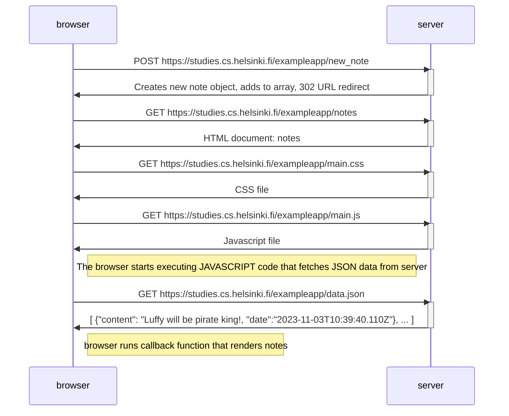

```mermaid

sequenceDiagram
    participant browser
    participant server

    browser->>server: POST https://studies.cs.helsinki.fi/exampleapp/new_note
    activate server
    server->>browser: Creates new note object, adds to array, 302 URL redirect 
    deactivate server

    browser->>server: GET  https://studies.cs.helsinki.fi/exampleapp/notes
    activate server
    server->>browser: HTML document: notes
    deactivate server

    browser->>server: GET https://studies.cs.helsinki.fi/exampleapp/main.css
    activate server
    server->>browser: CSS file
    deactivate server

    browser->>server: GET https://studies.cs.helsinki.fi/exampleapp/main.js
    activate server
    server->>browser: Javascript file
    deactivate server

    Note right of browser: The browser starts executing JAVASCRIPT code that fetches JSON data from server

    browser->>server: GET https://studies.cs.helsinki.fi/exampleapp/data.json
    activate server
    server->>browser: [ {"content": "Luffy will be pirate king!, "date":"2023-11-03T10:39:40.110Z"}, ... ]
    deactivate server
    
    Note right of browser: browser runs callback function that renders notes

```