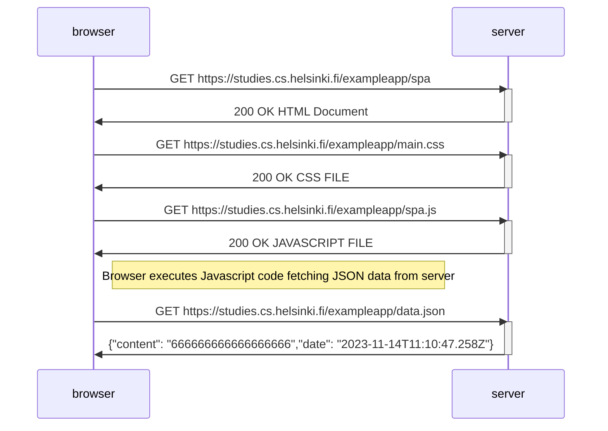

```mermaid

sequenceDiagram
    participant browser
    participant server

    browser->>server:GET https://studies.cs.helsinki.fi/exampleapp/spa
    activate server
    server->>browser:200 OK HTML Document
    deactivate server

    browser->>server:GET https://studies.cs.helsinki.fi/exampleapp/main.css
    activate server
    server->>browser: 200 OK CSS FILE
    deactivate server

    browser->>server:GET https://studies.cs.helsinki.fi/exampleapp/spa.js
    activate server
    server->>browser: 200 OK JAVASCRIPT FILE
    deactivate server
    
    note right of browser: Browser executes Javascript code fetching JSON data from server

    browser->>server: GET https://studies.cs.helsinki.fi/exampleapp/data.json
    activate server
    server->>browser:{"content": "666666666666666666","date": "2023-11-14T11:10:47.258Z"}
    deactivate server
```